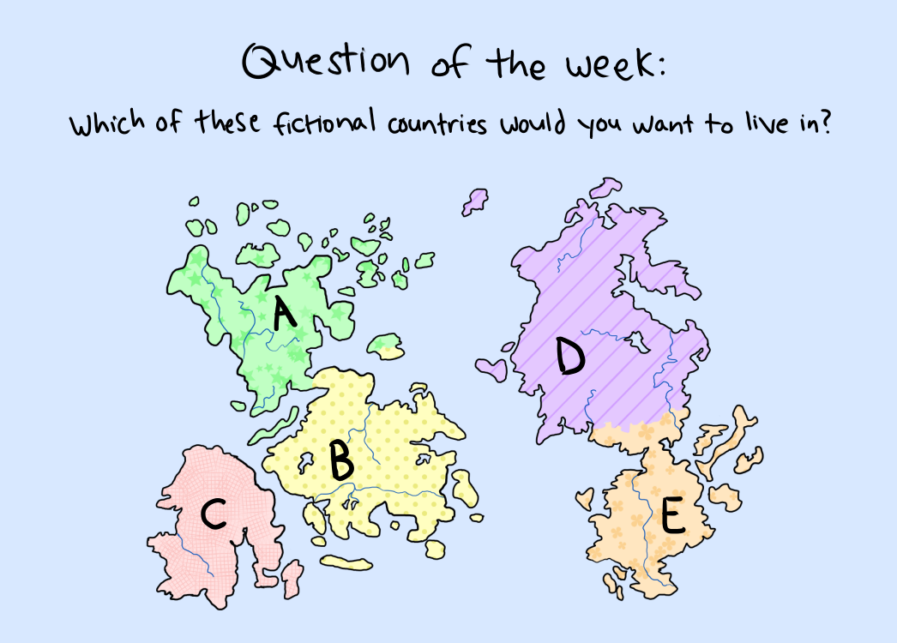

<div class="row">
<div class="medium-4 medium-push-8 columns" markdown="1">
<div class="panel radius fixed-toc"  data-options="sticky_on:large" markdown="1">
**Table of Contents**
{: #toc }
*  TOC
{:toc}
</div>
</div><!-- /.medium-4.columns -->

<div class="medium-8 medium-pull-4 columns" markdown="1">

## Due Dates & Links

<ul>

<li><a href="{{ todo.url }}">{{ todo.name }}</a> - Due {{ todo.due-date }}</li>

</ul>

## Lecture Materials
<ul>

<li><a href="{{handout.url}}">{{handout.name}}</a></li>

</ul>

### Video Shorts


<iframe width="560" height="315" src="{{video.url}}" title="YouTube video player" frameborder="0" allow="accelerometer; autoplay; clipboard-write; encrypted-media; gyroscope; picture-in-picture; web-share" allowfullscreen></iframe> 


<!-- ### In-class notes

<a href="{{ note.url }}">{{ note.name }}</a>
<iframe src="{{ note.url }}/preview" width="640" height="480" allow="autoplay"></iframe>
 -->

### Links to Podcast
**Note:** Links will require you to log in as a UCSD student
<ul>
 
<li><a href="{{link.url}}">{{link.name}}</a></li>

</ul>

## Lab Tasks
    
---
    
Discuss with your group:
    

    
Write down your answers (and why you chose them!) in your group's shared doc.
    
---

In this lab, you'll be presented with a sequence of common debugging scenarios
that we have noticed students encountering this quarter. For each one, there's a
brief description and a screenshot. Your job is to *reproduce* the error shown
in the screenshot so that you see it on your own computer, and then describe the
fix.

For **each** of the scenarios below, you should:

1. **Write down in notes**: Discuss and confirm with your partner – what is the
**desired** or **expected** behavior, and which part of the output is wrong or
not what's expected?
2. Reproduce this behavior with your partner. If you have to, take the time to
write out exactly the command-line in a suitable repository. To reproduce, we mean
getting your terminal/editor to look as much like the one in the screenshot as
possible. It might not be possible to make it _exactly_ the same—your username
will be different, for instance—but you should see the same error message for
the same command.
3. **Write down in notes**: Take a screenshot of your reproduction and put it in
the notes, along with a description of how you reproduced it (e.g. if you first
cloned a repository, opened a terminal, and changed directory, for example).
4. **Write down in notes**: Describe how to change the commands or program to get
the _expected_ output. This might take some time and thinking! Did you need to
gather any more information to figure out the issue? What helped you figure out
the issue in the end? If you had a tutor or someone else help, what suggestions
did they make to lead you to the answer?
5. **Write down in notes**: Have you ever made this mistake before? What was easy
or hard about noticing the error? What could you do in the future to notice or
fix it more quickly?

_(This is good practice and gives some understanding about what we do as course
staff when we see your EdStem posts!)_

One skill we're practicing here is **reproducing** bugs. In general when
reporting issues or asking questions, there's a question of
**reproducibility**: whoever is seeing the error usually doesn't have
access to your running system, so **reproducing** the possible error from the
given information is a key step. Sometimes screenshots are more helpful than
just text, because they include the Visual Studio Code file browser or other
similar visual details. Sometimes text is more helpful than a screenshot,
because it can be easily copy-pasted to try out some code on another computer.
You can always provide both to really help the person trying to reproduce the
error, which is what we do in some cases below!

### Scenario 1

Here's a screenshot of an error (right-click and "Open Image in New Tab" to see
it if it's too small).  For reference, this one was using the [lab 3 code
repository](https://github.com/ucsd-cse15l-w23/lab3). The programmer was trying
to run the tests.


### Scenario 2

The repostory used is similar to this one, but pay attention to differences in
`grade.sh`:

[list-examples-grader](https://github.com/ucsd-cse15l-f22/list-examples-grader/blob/main/grade.sh)


### Scenario 3

`bug.sh` contains the following code:

```bash
VAR=7

if [[1 -eq $VAR ]]
then
  echo "it was 1"
fi
```


### Scenario 4

A project has the following file layout:


The contents of `Code.java` is this:

```java
import java.io.File;

public class Code {
   public static void main(String[] args) {
       File file = new File(args[0]);
       if (file.exists()) {
           System.out.println("File exists, yay!");
       }
       else {
           System.out.println("The file does not exist :(");
       }
   }
}
```

Then this surprising result happens (the programmer was expecting the file to
be reported as existing):


### Reflection

You've learned a lot this quarter! (We hope)

It's useful to reflect on what we've learned. (Seriously, it helps with the
learning process to do reflection.)

Think about what you've learned in labs, lecture, and quizzes this quarter.
Think about a question or a problem that you can answer now that you would not
have been able to at the begining of the quarter. **Write it down in the notes**.

Then, the other people in your group will try to answer it or talk about how
they would go about solving the problem using things they learned in class. Did
they have the same answer as you? Did they highlight any different parts of
their learning?

The best learning here will come from questions that aren't one-line answers
(“how do you git push from the command line” won't be a useful reflection, for
instance). A task you can imagine doing with a few lines of a `bash` script, a
strategy for debugging or choosing good test cases, a workflow for setting up a
project, a choice of Java feature for a particular program, and more could be
good examples of things to discuss.

### Open Discussion

Spend the remainder of the time discussing general computing/CSE
department/course/research topics with your group and tutor.

Some potential conversation starters to ask your tutor are:

- What classes are you taking?
- Are you involved in any student organizations?
- Have you done an internship recently?
- What topics from CSE15L come up again and again in your courses?
- Are you involved in research?
- What has been your favorite/least favorite course at UCSD?

Feel free to mix groups, listen in on other conversations, move around the room,
and ask these questions to the lead TA, too!

## Lab Report 5

Go back and pick a favorite lab report or a lab activity you really liked or did
not finish. Write a post going into detail on how you did the task, doing the
task in a different way, or applying something you learned later to the same
task. For example (and you can use these ideas if you like):

- For lab report 2 (about `StringServer`), use `jdb` to set a breakpoint and
answer the questions about the values of variables, fields, and arguments.
- For lab report 3 (about `find`/`grep` etc) do the same exploration of several
options for a different command or commands
- For lab report 4 (about doing commands quickly), how could you have done the
task _very_ quickly by writing a `bash` script (even if that was against the
rules)
- For lab 6 (about creating a grading script), finish the grading script and
take screenshots that demonstrate it working on several files. (A similar script
will be part of the second skill demo, so it's a worthwhile thing to understand
in detail!)
- Your own idea, as long as it's reasonably as in-depth as these options.

There **will not** be a resubmission window for lab report 5, so do your best to
be thorough, creative, and clear in your submission.

